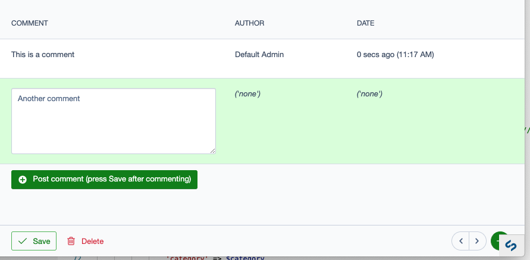
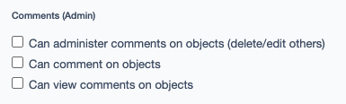

Model Comments
==============

This is a plugin for [Silverstripe CMS](https://www.silverstripe.org).

This package allows the creation of a comment feed within the detail form of a ModelAdmin-based app.

Example
-------



The current view is very simple, as this is an MVP. It builds on the work of [gridfieldextensions](https://github.com/symbiote/silverstripe-gridfieldextensions).

Set up
------

First, install the module. As it's an MVP, only dev-master is available:

```
> composer require sminnee/silverstripe-modelcomments:dev-master
```

Then, add HasModelCommentsExtension to objects that you wish to comment on.

```php
<?php

use SilverStripe\ORM\DataObject;
use Sminnee\ModelComments\HasModelCommentsExtension;

class MyClass extends DataObject
{
    // ...

    private static $extensions = [
        HasModelCommentsExtension::class,
    ];

    // ...
}
```

Finally, assign commenting, view comment, and administer comment permissions to the appropriate user groups.


